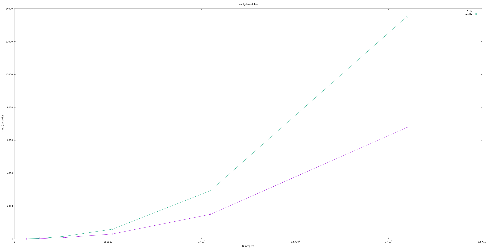

# `µlib`

A simple C library for convenience and basic data structures

### Design

#### Worse really is better

In his seminal essy [*Worse Is Better*](https://dreamsongs.com/WIB.html),
Peter Gabriel defined the following characteristic of what he called the
"New Jersey" approach to software, typified by Unix and C:

> Simplicity -- the design must be simple, both in implementation and interface.
> It is more important for the implementation to be simple than the interface.
> Simplicity is the most important consideration in a design.

Further, Gabriel states:

> Completeness can be sacrificed in favor of any other quality. In fact,
> completeness must be sacrificed whenever implementation simplicity is
> jeopardized. Consistency can be sacrificed to achieve completeness if
> simplicity is retained

`µlib` attempts to follow the worse-is-better philosophy by placing simplicity
as its leading design consideration.

#### Out-of-memory strategy

What to do if `malloc()` returns `NULL`? `µlib` chooses the segfault strategy.
It doesn't check the return value of internal `malloc()` calls. As a result,
your program will crash if `malloc()` returns `NULL`.

### Features

`µlib`'s goal is to to offer various basic data structures that make working
with C easier. These could include:

* Dynamic arrays
* Linked lists
* Binary search trees
* Hash tables
* Self-sizing strings

### Performance

`µlib` contains a work-in-progress benchmark suite that compares its performance
against the widely use [GLib](https://wiki.gnome.org/Projects/GLib)
cross-platform, low-level C library. Currently, the performance of creating a
new singly-linked list N integers is as follows:



The measurements were run against GLib 2.66.7 with the Linux `time` utility.

### Installation

`µlib` has no dependencies outside of the C standard library. Currently, it's
tested with `glibc` and `gcc` on arm64 Linux.

`µlib` uses the [Meson](https://mesonbuild.com/) build system. To build it,
navigate to the root directory and run the following commands:

```
meson builddir
cd builddir/
meson compile
meson install
```

Each header is designed to be used independent of the rest of the library. For
example, to make use of `MuStr`, `#include <mu-str.h>` in your application.
